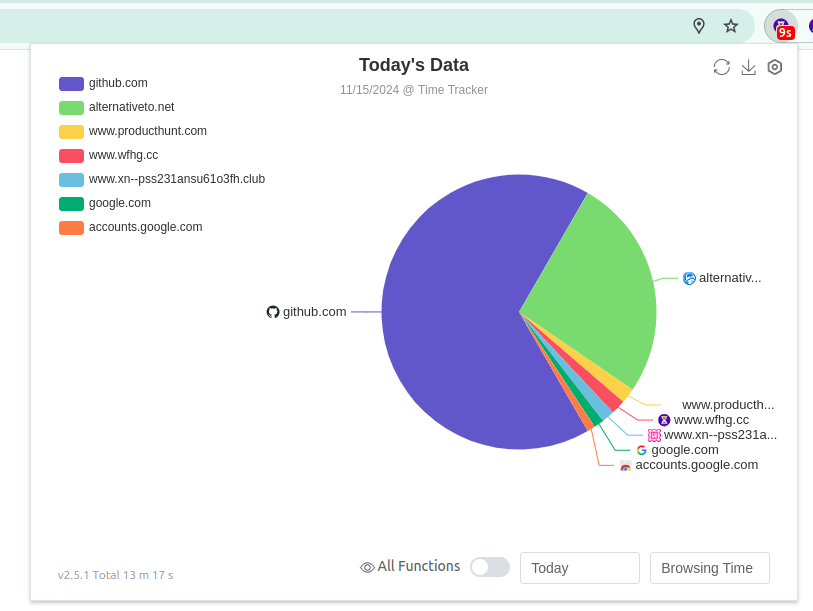
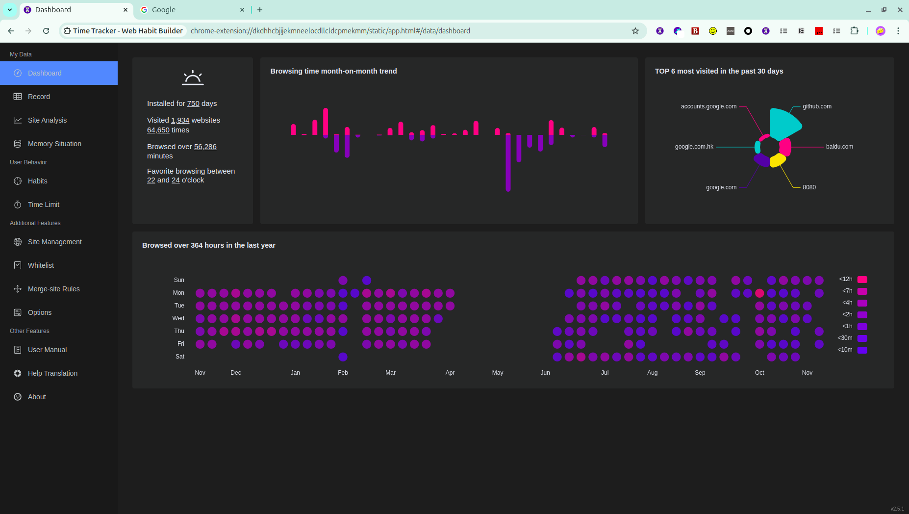
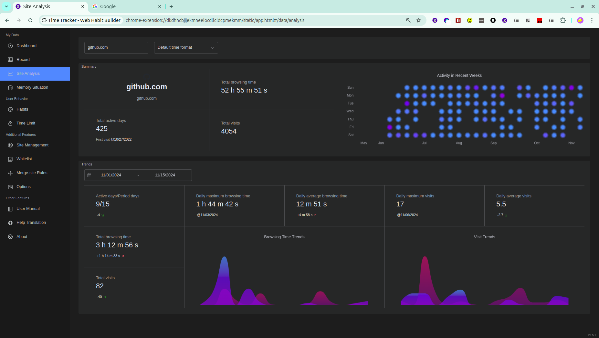
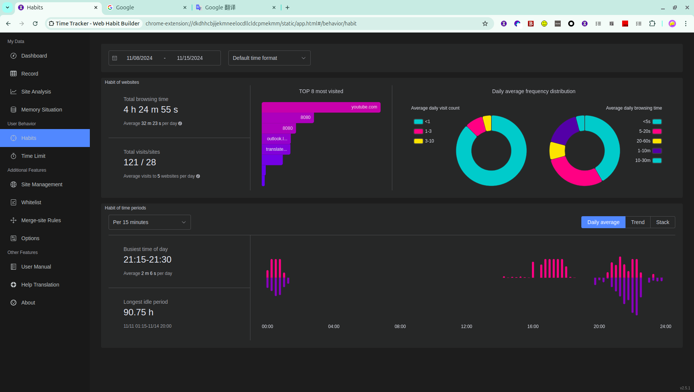
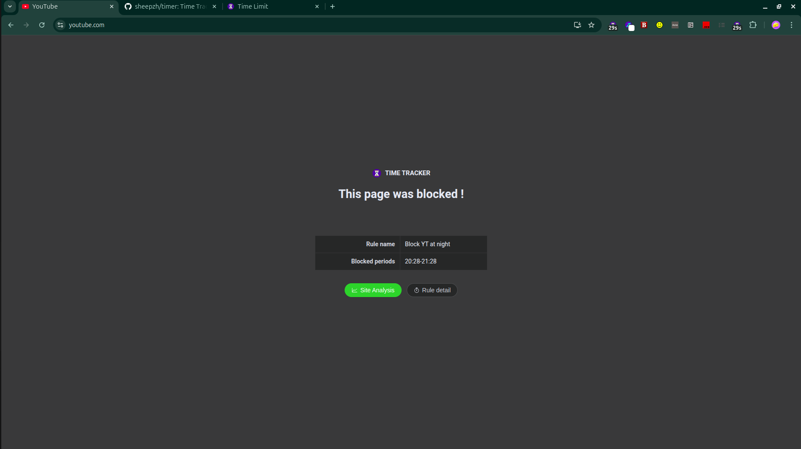

# Web Time Tracker

**Project forked from [time-tracker-4-browser](https://github.com/sheepzh/time-tracker-4-browser), and this repo maintains an individual feature branch.**

---
Web Time Tracker is a browser extension to track the time you spent on all websites. It's built by rspack, TypeScript and Element-plus. And you can install it for Firefox, Chrome and Edge.

## Screenshots

    
    
Daily percentage

    
    
Dashboard

    
    
Analytical Report

    
    
Habit Report

    
    
Page Blocking

