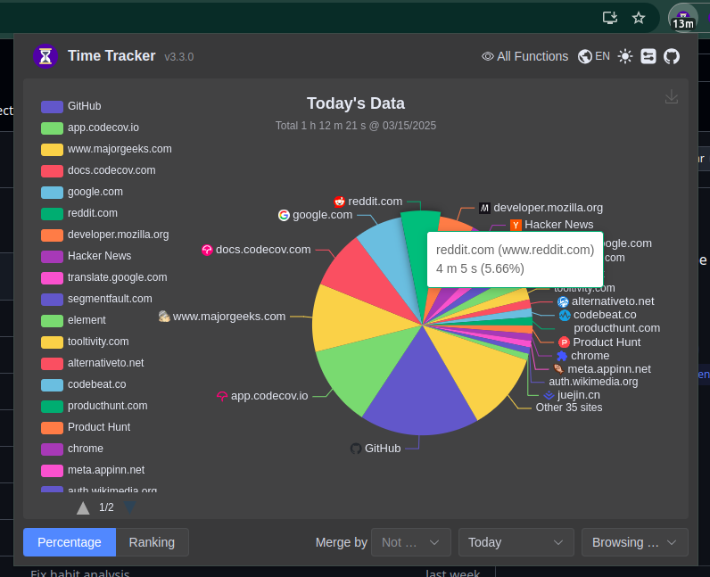

# Time Tracker for Browser

Time Tracker is a browser extension to track the time you spent on all websites. It's built by rspack, TypeScript and Element-plus. And you can install it for Firefox, Chrome and Edge.

## Download

| Released                                                                                                                            | Version                                                                                                                                                                                                     | Rating                                                                                                                                                                                                             | User Count                                                                                                                                                                                                   |
| ----------------------------------------------------------------------------------------------------------------------------------- | ----------------------------------------------------------------------------------------------------------------------------------------------------------------------------------------------------------- | ------------------------------------------------------------------------------------------------------------------------------------------------------------------------------------------------------------------ | ------------------------------------------------------------------------------------------------------------------------------------------------------------------------------------------------------------ |
| [Chrome Web Store](https://chromewebstore.google.com/detail/time-tracker-for-browser/dkdhhcbjijekmneelocdllcldcpmekmm?hl=en)        |                                                                                                    |                                                                                                      |                                                                                                              |
| [Microsoft Edge Addons](https://microsoftedge.microsoft.com/addons/detail/time-tracker-web-habit-/fepjgblalcnepokjblgbgmapmlkgfahc) |  |  |  |
| [Firefox Browser Addons](https://addons.mozilla.org/en-US/firefox/addon/besttimetracker/)                                           |                                                                                                                                           |                                                                                                                                                          |                                                                                                                                       |

[How to install manually for Safari](./doc/safari-install.md)

## Screenshots

    
    
Daily percentage

    
    
Dashboard

    
    
Analytical Report

    
    
Habit Report

    
    
Page Blocking

## Thanks

